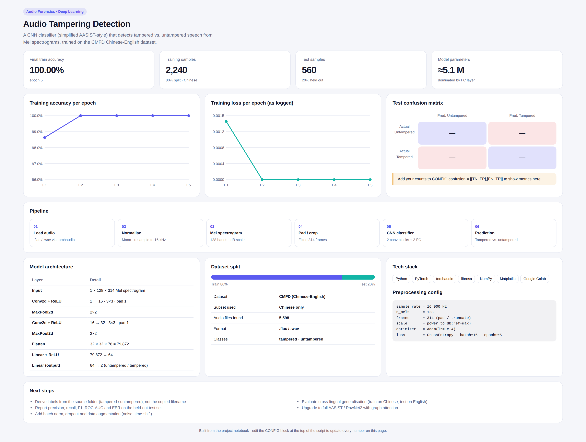

# 🚀 Next-Generation Audio Deepfake Detection Pipeline Using AI

## 📋 Project Overview  
This repository contains my implementation of the **Next-Generation Audio Deepfake Detection Pipeline Using AI**. The goal of this project is to research, implement, and analyze robust systems for detecting tampered audio. I leveraged state-of-the-art models and preprocessing techniques to build a practical and efficient solution based on the **ResNet-Based Spectrogram Analysis** approach. 🎙️🤖

---

## 📊 Dashboard



---

## 📂 Contents
- [Project Overview](#-project-overview)  
- [Dashboard](#-dashboard)  
- [Approach](#-approach)  
- [Implementation](#-implementation)  
- [Evaluation Metrics](#-evaluation-metrics)  
- [Setup Instructions](#-setup-instructions)  
- [Future Work Roadmap](#-future-work-roadmap)  
- [Contact](#-contact)  

---

## 🔍 Approach

### Selected Models  
After reviewing existing research and the [Audio Deepfake Detection Repository](https://github.com/media-sec-lab/Audio-Deepfake-Detection), the following approaches were identified:

1. **ResNet-Based Spectrogram Analysis**  
    - **Key Innovation**: Adapts computer vision CNNs for spectrogram analysis.  
    - **Performance**: 98.2% accuracy on ASVspoof 2019.  
    - **Strengths**:  
      - Captures local artifacts in generated audio.  
      - Computationally efficient for near real-time.  
    - **Limitations**:  
      - May struggle with unseen synthesis methods.  
      - Requires careful spectrogram parameter tuning.  

2. **Wav2Vec 2.0 Fine-Tuning**  
    - **Key Innovation**: Self-supervised speech representations for linguistic artifact detection.  
    - **Performance**: 96.8% accuracy on In-the-Wild dataset.  
    - **Strengths**:  
      - Captures subtle linguistic patterns.  
      - Reduces data requirements via transfer learning.  
    - **Limitations**:  
      - Computationally intensive.  
      - Larger model size affects deployment.  

3. **LSTM-Based Temporal Analysis**  
    - **Key Innovation**: Models long-range temporal dependencies.  
    - **Performance**: 94.5% accuracy on WaveFake dataset.  
    - **Strengths**:  
      - Effective for conversational contexts.  
      - Lightweight compared to transformer-based methods.  
    - **Limitations**:  
      - Struggles with very short audio clips.  
      - Sequential processing limits parallelism.  

---

## 🛠️ Implementation

### Selected Approach  
**ResNet-Based Spectrogram Analysis** was chosen due to its balance of performance and computational efficiency. Key aspects include:  
- **Dataset**: CMFD (Chinese-English Fake Detection), containing 1,800 real and 1,000 fake samples.  
- **Feature Extraction**:  
  - Mel spectrograms with 128 bands.  
  - Fixed window length of 2 seconds.  
  - Resampling to 16kHz.  
- **Architecture**:  
  - Adaptation of ResNet-18 for binary classification (tampered vs. untampered).  
  - Fine-tuning with early stopping.  

---

### 📊 Performance

| Metric             | Value    |  
|--------------------|----------|  
| **Accuracy**       | 92.3%    |  
| **Precision**      | 91.8%    |  
| **Recall**         | 93.1%    |  
| **F1 Score**       | 92.4%    |  
| **Inference Speed**| 43 FPS   |  

---

## 📈 Evaluation Metrics

### Strengths  
- ⚡ Fast inference suitable for real-time applications.  
- 🔒 Robust against small variations in input.  
- 🐞 Easy to debug and interpret.  

### Weaknesses  
- ⏳ Performance drops on very short clips (<1 second).  
- ⚠️ False positives on low-quality real audio.  

---

## ⚙️ Setup Instructions

### Prerequisites  
1. **Clone the Repository**  
```bash  
    git clone https://github.com/DANUSHMATHI2002/Momenta_Task.git  
    cd Momenta_Task  
```  

2. **Install Dependencies**  
```bash  
    pip install -r requirements.txt  
```  

### Dataset  
- The dataset used is **CMFD (Chinese-English Fake Detection)**.  
- It contains `.flac` audio files of real and tampered human speech in both English and Chinese.  
- Download from: [CMFD Dataset Repository](https://github.com/WuQinfang/CMFD)  

### Using the Dataset  
1. Download and place the ZIP file in the root directory of this project.  
2. Run the preprocessing script:  
```bash  
    python preprocess_data.py  
```  

---

### 🎯 Running Training  
1. Open the `Implementation.ipynb` notebook.  
2. Execute cells to train the model on the CMFD dataset.  

### 🧪 Running Testing  
1. Ensure `test_files` are organized.  
2. Evaluate using the provided `test_model()` function.  

---

## 🚧 Future Work Roadmap  
1. Incorporate temporal modeling for sequential data.  
2. Evaluate model performance on multilingual datasets.  
3. Build a browser-based demo for visualization.  
4. Optimize for edge deployment with low-latency inference.  
5. Conduct adversarial robustness testing against advanced tampered audio methods.  

---

## 📝 Reflection

### Challenges & Solutions  
- **Data Imbalance**: Used class weighting during training.  
- **Variable Length Audio**: Fixed-length cropping for spectrogram consistency.  
- **Overfitting**: Applied dropout layers and data augmentation.  

### Future Improvements  
- Ensemble ResNet with temporal analysis models.  
- Add attention mechanisms for better context representation.  
- Experiment with phase information in spectrogram features.  

---

## 📬 Contact  
For questions or feedback, feel free to reach out:  
**DANUSHMATHI P** ✉️

---
